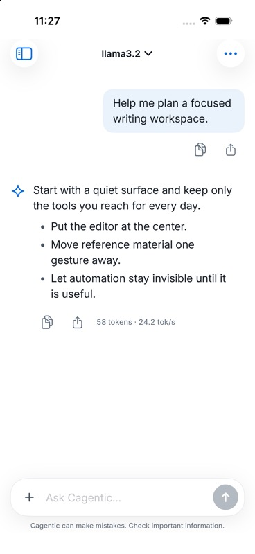
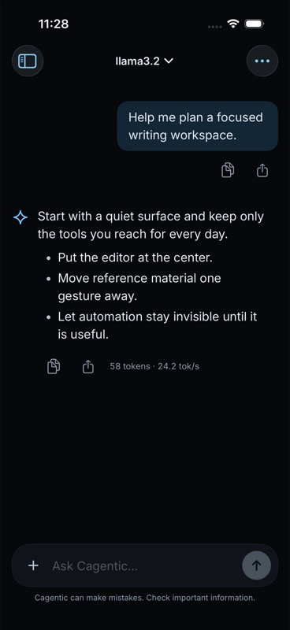
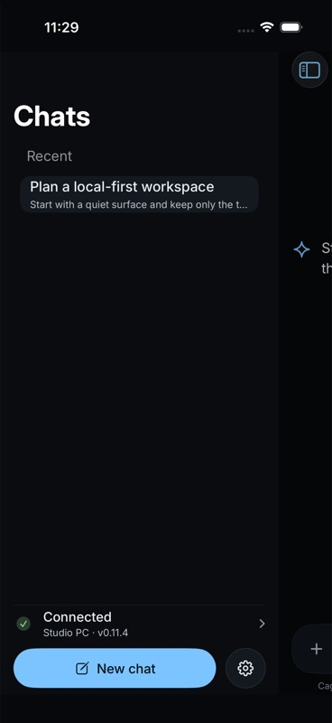
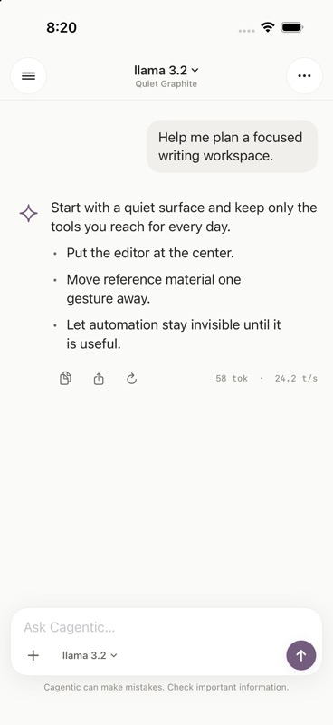
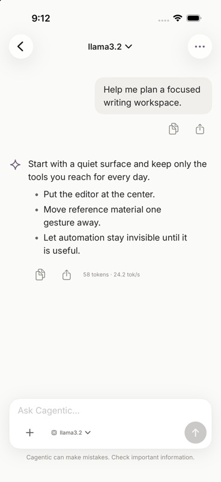
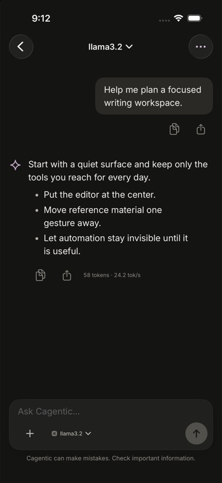
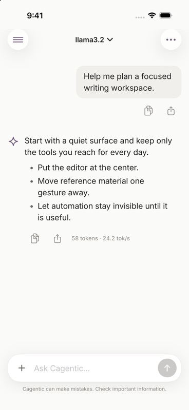
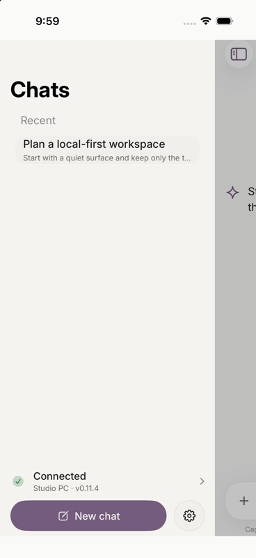
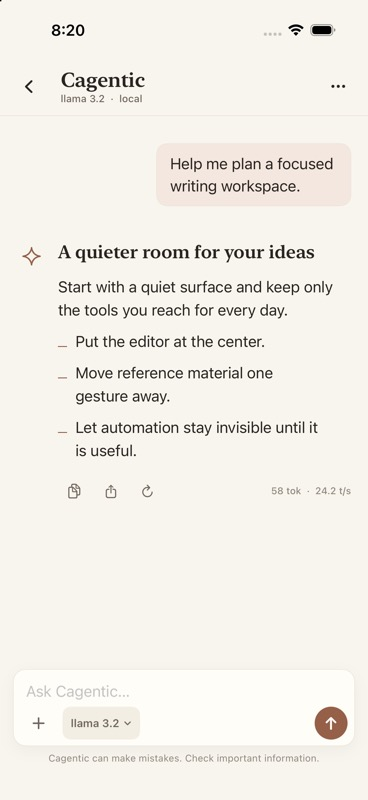
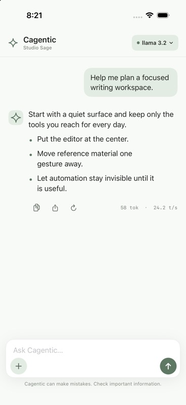

# Cagentic iPhone theme studies

These studies use the same chat content and were captured from an iPhone 17
simulator. Quiet Graphite established the selected structure; production now
uses the gateway's graphite-and-blue palette so every Cagentic surface shares
one identity. The other studies remain as a decision record.

## Production — Gateway Graphite

| Light | Dark | Dark drawer |
| --- | --- | --- |
|  |  |  |

## A — Quiet Graphite

- Canvas `#FAFAF8`, raised surface `#F0EFEC`, ink `#20201E`
- Muted plum accent `#735C7D`
- Inter throughout; Dynamic Type-aware 17 pt body with compact navigation
- 180 ms ease-out motion with very small opacity and position changes

### Original selected pass

| Light | Dark |
| --- | --- |
|  |  |

### iPhone chat controls

| Compact composer | Sliding chat drawer |
| --- | --- |
|  |  |

## B — Ink & Linen

- Linen canvas `#F8F5EE`, warm surface `#FFFDF8`, ink `#29241F`
- Clay accent `#955F48`
- New York-style system serif for identity and response headings; 17 pt SF Pro body
- 240 ms ease-out motion with a quiet four-point rise on disclosure

## C — Studio Sage

- Cool stone canvas `#F8FAF7`, white surface, charcoal `#20241F`
- Muted sage accent `#5F7864`
- SF Pro throughout; denser 16 pt body and stronger model-state hierarchy
- 220 ms low-bounce spring for focus and insertion, with opacity-only Reduce Motion behavior
